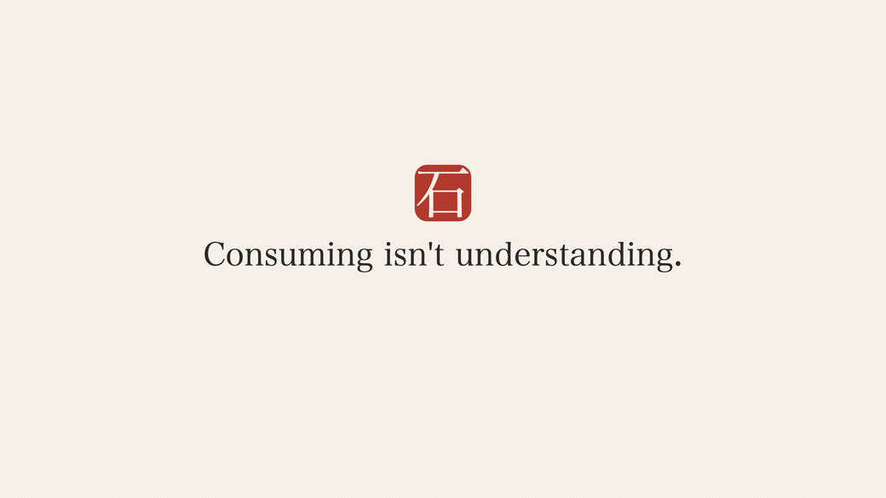

# 🪨 Whetstone

**Remember what you read, watch, and listen to — well enough to explain it months later.** Your
AI agent becomes the tutor; your memory lives in plain markdown files you own. It's not AI Anki.

<p align="center">
  
</p>

Watch a video, read a paper, listen to a podcast → tell your agent `/whetstone <link>` → it
pulls out the few ideas worth keeping, quizzes you immediately, and brings each one back on an
expanding schedule — **rephrasing the question every time** so you rehearse *understanding*, not
one memorized card. Fifteen minutes a day, max.

## The problem it solves

You watch a video that explains PPO completely, feel like you learned it, and couldn't explain
it in an interview a month later. That gap is the target. The failure isn't that a fact leaked
out — it's that you only ever *recognized* the idea while it was explained to you; you never
*generated* the explanation yourself. Whetstone makes you generate it, right after consuming and
again at spaced intervals, from a fresh angle each time.

## Why this isn't "AI Anki"

- **The unit is a concept, not a card.** Each item stores the correct explanation and a *menu of
  angles* — never a frozen question. The skill writes a new question every session (derive it,
  apply it to your work, break it). A card trains recognition of itself; varied retrieval is what
  transfers to a reworded question ([the science](#the-science)).
- **Your agent is the tutor.** Teach-backs are graded in real conversation against a reference
  model — it names the exact joint you missed. Grading runs inside the agent subscription you
  already have: **zero API cost.**
- **Targeting, not just construction.** The hard part isn't making cards, it's deciding what
  deserves to be remembered. Every source is triaged into **core** (durable, kept for years),
  **gist** (situational, held while relevant), or **log** (a searchable one-line trace, no
  reviews). Consuming something and carding *nothing* is a normal, correct outcome.
- **Files are the API.** Everything is plain markdown ([FORMAT.md](FORMAT.md)) in a folder you
  choose. Drop it in your Obsidian/Logseq vault and the concepts become native notes (graph,
  backlinks, phone); don't have a vault, and it's just a folder. No database, no account, no
  silo. Your sync (iCloud, Dropbox, Obsidian Sync, git) is the sync.
- **One writer, no review debt.** The `/whetstone` skill is the only thing that writes state.
  Sessions are capped (15 min / 8 concepts). Nothing you've learned is ever deleted for
  *succeeding* — durable concepts are maintained at long intervals; you archive things
  deliberately when they stop mattering. Backlogs get triaged, never guilted over.
- **Model-agnostic.** The skill is a markdown instruction file; any capable agent (Claude Code,
  Cowork, Codex, Cursor…) runs it over the same files. Quality scales with the model you bring.

## The pieces

| File | Role |
|---|---|
| `SKILL.md` | The agent skill — the only writer: setup, ingest, session/grading, reflect |
| `FORMAT.md` | The open spec — concepts, log, profile, config. Any tool that reads it is a client |
| `decks/` | One markdown file per source you chose to actively learn (core/gist concepts) |
| `LOG.md` | Append-only trace of everything consumed — the "log" tier; searchable, promotable |
| `profile.md` | How you tend to misunderstand things (append-only) — steers future questions |
| `hub/index.html` | Optional **read-only viewer** of your folder. Static page, zero network calls |

## Install

### Recommended — let your agent install it

You have an AI agent already; let it do the work. **Paste the prompt below** to Claude Code,
Cursor, Codex, Windsurf, or any capable agent. It fetches the skill, installs it for your
specific tool, and then interviews you — one question at a time — so the setup is right for
*your* machine, PKM, and sync:

````text
Set up the Whetstone learning system for me.

1. Fetch these two files from GitHub:
   • https://raw.githubusercontent.com/smdesai27/whetstone/main/SKILL.md
   • https://raw.githubusercontent.com/smdesai27/whetstone/main/FORMAT.md
2. Install the skill so I can invoke it as /whetstone. For Claude Code that's
   ~/.claude/skills/whetstone/SKILL.md (create the folder); keep FORMAT.md beside it. For a
   different agent, put SKILL.md wherever your rules/commands/skills load from — ask me if you
   are unsure. (If you have a shell, you may instead run:
   curl -fsSL https://raw.githubusercontent.com/smdesai27/whetstone/main/install.sh | sh)
3. Then run Whetstone's first-run Setup mode exactly as SKILL.md describes. Ask me, one question
   at a time and waiting for each answer:
   - whether I keep a PKM / vault (Obsidian, Logseq, …) and where inside it the whetstone folder
     should live — otherwise default to ~/Whetstone/;
   - what syncs that location (iCloud, Dropbox, Obsidian Sync, git, or nothing) — recommend a
     synced spot, since it's what makes phone and hub review work.
   Create whetstone.json, an empty decks/ folder, profile.md, and LOG.md there — never
   overwriting anything that already exists.
4. Finally: tell me the folder you created, point me to the read-only hub at
   https://smdesai27.github.io/whetstone/, and show me how to add my first source with
   /whetstone <link or file>.

Confirm each step as you go.
````

### Or install it yourself

```sh
# Claude Code — macOS / Linux / WSL
curl -fsSL https://raw.githubusercontent.com/smdesai27/whetstone/main/install.sh | sh
```
```powershell
# Windows PowerShell
irm https://raw.githubusercontent.com/smdesai27/whetstone/main/install.ps1 | iex
```

Or copy `SKILL.md` into your agent's skills directory by hand (Claude Code:
`~/.claude/skills/whetstone/SKILL.md`; run `install.sh --print-paths` for every other agent).
Then run `/whetstone` — with no config present it enters Setup mode and walks you through the
same questions.

Either way, once you're set up: open the read-only hub at
**https://smdesai27.github.io/whetstone/** in Chrome/Edge/Brave and point it at your folder — no
download, no account. Want to see it populated first? Point it at this repo's `sample/` folder.

**Every agent, PKM, OS, and sync combination is covered in [INSTALL.md](INSTALL.md).**

## Daily loop

- **Consume something** → `/whetstone <link or file>` → it triages, files the few concepts worth
  keeping (the rest goes to `LOG.md`), and quizzes you immediately.
- **Review** → run `/whetstone` with no argument. It writes a fresh question for each due
  concept, grades your explanation, tells you exactly what you missed, and reschedules. **All
  learning happens here, in the skill.**
- **Glance anywhere** → open the hub (or your PKM, or the files on your phone) to *see* what's
  sharp, what's due, and your log. The hub is a viewer — it never grades and never writes.
- **Movies / shows / novels** → `/whetstone reflect on <title>` — a structured reflection
  conversation instead of a quiz (retention isn't the goal there; thinking is).

## Privacy model

The hub is a **read-only static page with zero backend.** It makes no network calls; your files
are read through your browser's local folder permission (read-only) and never leave your machine.
Hosting it on GitHub Pages publishes the *app*, not anyone's *data* — like publishing a
calculator: everyone sees the same empty tool, each user's numbers stay their own. Nothing about
your learning is ever in this repo or on any server. Verify it yourself: the page is one readable
HTML file, and DevTools' network tab stays empty.

## The science

Practice testing (active recall) and distributed practice (spacing) are the only two
"high-utility" techniques in Dunlosky et al. (2013)'s landmark review; rereading and highlighting
rate low. Two refinements shape Whetstone's design:

- **Total spacing is what matters — not the ladder's shape.** A first retrieval delayed enough to
  take effort while still succeeding, spread over time, is the causal driver (Karpicke &
  Bauernschmidt 2011). Whether intervals expand or stay equal barely moves retention (Latimier et
  al. 2021 meta-analysis, g≈0.03). So Whetstone uses a simple expanding ladder without pretending
  the shape is the magic.
- **Varied retrieval buys transfer; frozen cards don't.** Reviewing the *same* question trains
  recall of that question (Price et al. 2025: d≈0.62 same-item vs d≈0.26 on reworded transfer
  questions). Whetstone regenerates the question each session precisely to close that gap — which
  is the whole reason a concept stores a reference model and a menu of angles instead of a fixed
  prompt.

The example deck in `decks/` teaches you this method itself.

## License

MIT
